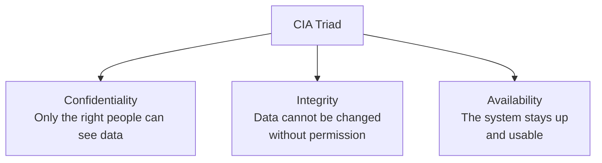
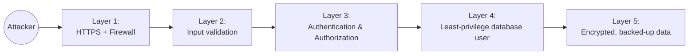
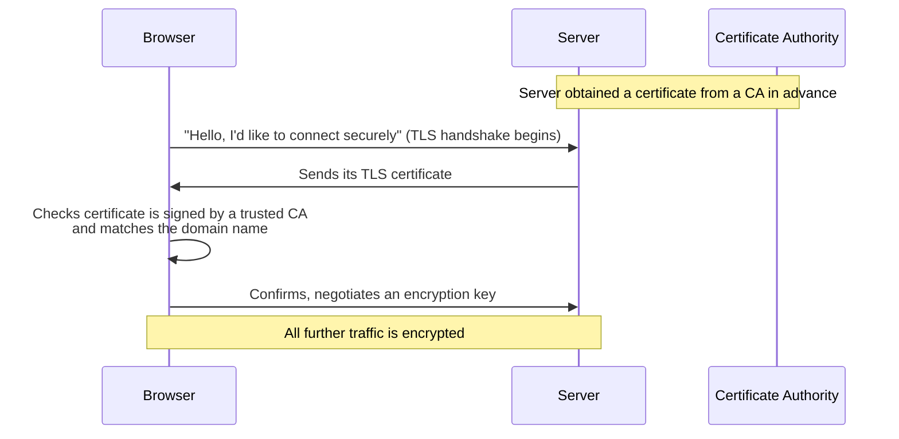
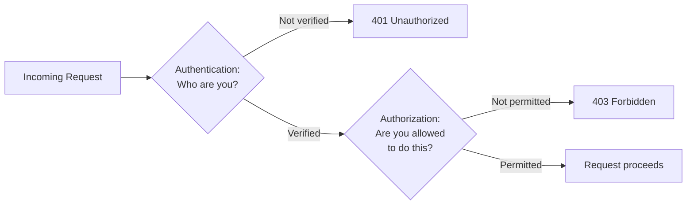

# Lecture 30: Application Security Basics

You have now built a full-stack application with a React front end, an Express back end,
and a database. Before you put that application on the Internet, you need to think about
how to keep it — and its users — safe. This lecture introduces the core principles of
application security: ideas you will use for the rest of your career, no matter which
language or framework you work in.

## In This Lecture

- Learn the CIA triad (Confidentiality, Integrity, Availability) and two guiding
  principles: least privilege and defence in depth
- Get a brief introduction to HTTPS/TLS, certificates, and security-related response
  headers
- Review the difference between authentication and authorization
- Learn the basics of input validation, output encoding, and secrets management

## Why Security Matters, Even for a Class Project

It is tempting to think "security is for big companies with millions of users, not for my
class project." This is a mistake. The moment your application is reachable on the
Internet — even from a free hosting service — it can be found and probed by automated
bots that scan for common weaknesses, 24 hours a day. Security is not an optional
add-on you bolt on at the end; it is a way of thinking that should influence decisions
you make throughout development.

!!! note "Security is a process, not a checklist"
    You cannot make an application "100% secure." Security is about reducing risk to an
    acceptable level and reacting quickly when something goes wrong, not about reaching
    some finish line where you are "done."

## The CIA Triad

Security professionals often describe the goals of a secure system using three words,
known as the **CIA triad**. This has nothing to do with the intelligence agency — it
stands for **Confidentiality, Integrity, and Availability**.



- **Confidentiality** means that information is only visible to the people who are
  supposed to see it. For example, one user's private messages should not be readable
  by another user, and a database of passwords should not be readable by an outside
  attacker. Encryption and access control are the main tools for protecting
  confidentiality.
- **Integrity** means that data cannot be changed (accidentally or maliciously) without
  authorization, and that if it is changed, you can detect it. For example, if a
  student's exam grade is stored in a database, integrity means nobody can quietly
  edit that grade without leaving a trace. Checksums, digital signatures, and proper
  access control all support integrity.
- **Availability** means that the system stays up and usable for legitimate users when
  they need it. An attacker who floods your server with fake traffic to knock it
  offline (a **denial-of-service attack**) is attacking availability, even though they
  never read or changed any data.

Every security decision you make can usually be mapped back to protecting one (or more)
of these three properties. For example, backing up your database protects
**availability** (you can recover from data loss) and, if backups are encrypted,
**confidentiality** too.

## Least Privilege

**Least privilege** is the principle that every user, process, or piece of code should
have *only* the permissions it strictly needs to do its job — nothing more.

Think about your Express backend's database user. If your API only ever needs to read
and write documents in one collection, that database user should not also have
permission to drop the entire database or create new admin accounts. If an attacker
somehow manages to run a malicious query through your API, least privilege limits the
damage they can do, because the account they compromised was never powerful enough to
cause a bigger disaster in the first place.

Least privilege applies at every level of a system:

- **Operating system level** — a web server process should not run as an all-powerful
  "root" or "Administrator" account.
- **Database level** — an application's database user should have only the permissions
  (read, write, on specific collections/tables) it actually needs.
- **Application level** — a regular user account should not be able to perform admin-only
  actions, and a "read-only" API key should not be able to trigger writes.
- **Team level** — not every developer on a project needs production database
  credentials; only the people who genuinely need that access should have it.

!!! tip
    When setting up any account, service, or API key, ask yourself: "What is the
    *smallest* set of permissions this needs to do its job?" Grant that, not more.
    It is much easier to grant an additional permission later than to clean up after a
    breach caused by over-broad access.

## Defence in Depth

**Defence in depth** is the principle that you should never rely on a single security
control to protect your system. Instead, you layer multiple, independent defences so
that if one fails, others are still standing.

Think of it like a castle: a castle does not rely on just a tall outer wall. It also has
a moat, a drawbridge, guards, and an inner keep. If an attacker gets past the wall, they
still have to deal with the moat, and so on.



In a web application, layers of defence might include:

1. HTTPS encrypting traffic between the browser and the server.
2. Input validation rejecting malformed or malicious data before it reaches your logic.
3. Authentication confirming who a user is.
4. Authorization confirming what that user is allowed to do.
5. A database user configured with least privilege, in case application-level checks
   are somehow bypassed.
6. Encrypted, regularly backed-up data, in case everything else fails.

If you only had step 3 (authentication) and nothing else, one bug in your login code
could expose your entire system. With defence in depth, one failure does not mean total
compromise.

## HTTPS, TLS, and Certificates

You have used `https://` URLs your entire life, probably without thinking about what is
happening underneath. Let's unpack it briefly — a full treatment of cryptography and TLS
internals belongs in a dedicated security or networking course, but every web developer
needs the basic picture.

**HTTP** (HyperText Transfer Protocol) sends data as plain text over the network. Anyone
who can intercept the traffic — for example, someone on the same public Wi-Fi network, or
your Internet provider — can read everything, including passwords typed into a login
form.

**HTTPS** (HTTP Secure) is HTTP layered on top of **TLS** (Transport Layer Security), a
protocol that encrypts the connection between the browser and the server. TLS is the
modern successor to an older protocol called **SSL** (Secure Sockets Layer); people
still often say "SSL" out of habit even though SSL itself is obsolete and no longer
considered safe to use.

HTTPS gives you three things at once, which map neatly back to the CIA triad:

- **Encryption** — nobody eavesdropping on the network can read the contents of the
  traffic (confidentiality).
- **Integrity** — the data cannot be silently modified in transit without detection
  (integrity).
- **Authentication of the server** — your browser can verify it is really talking to the
  server it thinks it is, not an impostor, using a **certificate**.

A **TLS certificate** (often just called an "SSL certificate") is a digital document
that proves a server's identity and contains a public cryptographic key. Certificates are
issued by trusted organizations called **Certificate Authorities (CAs)**. When your
browser connects to `https://example.com`, the server presents its certificate, and the
browser checks that a trusted CA has vouched for it. If the certificate is missing,
expired, or does not match the domain, the browser shows a warning instead of loading
the page.



!!! tip
    Free, automated certificate services like **Let's Encrypt** made HTTPS free and easy
    to set up, which is why almost the entire web now uses it by default. Most modern
    hosting platforms (which you'll meet in Lecture 32) issue and renew HTTPS
    certificates for you automatically — you rarely need to configure TLS by hand.

### Security-Related Response Headers

Beyond encrypting the connection itself, servers can send extra **HTTP response
headers** that tell the browser to enforce additional security rules. A full deep dive
into these headers belongs in a more advanced security course, but you should at least
recognize the most common ones:

| Header | What it does |
|---|---|
| `Strict-Transport-Security` | Tells the browser "always use HTTPS for this site, never fall back to plain HTTP," even if the user types `http://`. |
| `X-Content-Type-Options: nosniff` | Stops the browser from guessing a file's type, which can prevent certain attacks where a malicious file is disguised as something harmless. |
| `X-Frame-Options` | Controls whether your page can be loaded inside an `<iframe>` on another site, which helps prevent "clickjacking" tricks. |
| `Content-Security-Policy` | Restricts what sources of scripts, styles, and other resources a page is allowed to load — you'll see this in more detail in Lecture 31. |

In an Express app, a popular shortcut for setting many of these headers sensibly is the
`helmet` middleware package:

```javascript
const express = require("express");
const helmet = require("helmet");

const app = express();
app.use(helmet()); // sets several security-related headers with good defaults
```

## Authentication vs. Authorization, Revisited

Back in Lecture 25, you learned about authentication and authorization while building
login functionality. Because these two words are so often confused — and because getting
them backwards leads to real security bugs — it's worth reinforcing the distinction one
more time before you ship anything.

- **Authentication** answers the question: **"Who are you?"** It is the process of
  verifying an identity — typically by checking a password, a token, or some other
  proof. Logging in with a username and password is authentication.
- **Authorization** answers the question: **"What are you allowed to do?"** It happens
  *after* authentication, and it decides whether the now-identified user is permitted
  to perform a specific action, such as deleting another user's post or accessing an
  admin dashboard.



A simple way to remember which is which: authentication is like showing your student ID
card at the university gate to prove who you are. Authorization is like the ID card
having (or not having) permission to enter a specific lab. You can be authenticated (the
guard knows exactly who you are) and still not authorized (you still can't get into a
lab you have no permission for).

!!! danger "A common and serious bug: checking authentication but forgetting authorization"
    A very common mistake is writing an Express route that checks "is this user logged
    in?" (authentication) but forgets to check "is this *specific* user allowed to
    access *this specific* resource?" (authorization). For example, an endpoint like
    `GET /api/orders/:id` might correctly reject anonymous users, but then return
    *any* order by ID to *any* logged-in user — including other people's orders. Always
    ask both questions, not just the first one. This exact mistake is common enough that
    it has its own name, **broken access control**, which you'll study in Lecture 31.

The correct HTTP status codes reflect this distinction too: `401 Unauthorized` really
means "you have not proven who you are" (an authentication failure — despite the
confusing name, it should really be called "Unauthenticated"), while `403 Forbidden`
means "I know who you are, but you're not allowed to do this" (an authorization
failure).

## Input Validation and Output Encoding

Two of the most important, everyday security habits are validating input and encoding
output. They sound similar but happen at opposite ends of your data's journey through
your system.

### Input Validation

**Input validation** means checking that any data coming *into* your system — from a
form, a URL parameter, an uploaded file, or a request body — matches what you actually
expect, before you use it. Never trust data just because it came from your own frontend;
an attacker can send requests directly to your API using tools like `curl` or Postman,
completely bypassing your React forms and any validation you wrote there.

```javascript
// Express route with basic input validation
app.post("/api/signup", (req, res) => {
  const { email, age } = req.body;

  if (typeof email !== "string" || !email.includes("@")) {
    return res.status(400).json({ error: "A valid email is required." });
  }

  const numericAge = Number(age);
  if (!Number.isInteger(numericAge) || numericAge < 13 || numericAge > 120) {
    return res.status(400).json({ error: "Age must be a whole number between 13 and 120." });
  }

  // Only now is it safe to use email and numericAge
  res.status(201).json({ message: "Account created." });
});
```

!!! warning
    Client-side validation (in your React forms) is great for user experience — it gives
    instant feedback without a network round trip. But it provides **zero security** on
    its own, because it runs on the attacker's own computer, where they can disable or
    bypass it entirely. You must **always** re-validate on the server too. Treat
    client-side validation as a convenience, and server-side validation as the real
    security boundary.

In real projects, libraries like `joi`, `zod`, or `express-validator` are commonly used
to define validation rules once and apply them consistently, instead of writing manual
`if` checks for every field.

### Output Encoding

**Output encoding** is the mirror image of input validation: it means transforming data
right before you display or use it in a different context, so that it cannot be
misinterpreted as code or commands in that new context.

The clearest example is displaying user-generated text in HTML. Suppose a user's
"display name" is stored as the literal text `<script>alert('hi')</script>`. If your
frontend inserts this string directly into the page's HTML without encoding it, the
browser will treat it as an actual `<script>` tag and run it — this is the core of the
**Cross-Site Scripting (XSS)** attack you'll study in detail in Lecture 31. Output
encoding converts the special characters (`<`, `>`, `&`, `"`, `'`) into safe equivalents
(like `&lt;` and `&gt;`) so the browser displays the text as-is instead of executing it.

Modern frontend frameworks like React encode output for you automatically in most
cases — when you render `{userName}` inside JSX, React escapes it by default. The danger
appears when developers deliberately bypass that protection, for example with React's
`dangerouslySetInnerHTML` — a prop whose scary name is a deliberate warning sign.

## Secrets Management

A **secret** is any piece of information that must stay private for your system to
remain secure: database passwords, API keys for third-party services, JWT signing keys,
and cloud provider credentials are all secrets.

!!! danger "Never commit secrets to Git"
    One of the most common and damaging mistakes student (and professional!) developers
    make is committing a `.env` file or hard-coded API key directly into a Git
    repository — especially a public one on GitHub. Once a secret is pushed to a public
    repository, consider it **permanently compromised**, even if you delete it in a
    later commit: it still exists in the Git history, and automated bots scan public
    GitHub repositories for exposed keys within minutes of a push.

The standard practice, which you have likely already used earlier in this course, is:

1. Store secrets in environment variables, typically loaded from a `.env` file during
   local development (using a package like `dotenv`).
2. Add `.env` to your project's `.gitignore` file so Git never tracks it.
3. Commit a `.env.example` file instead, listing the variable *names* your app needs
   with placeholder values, so teammates know what to set up without seeing real
   secrets.
4. On your hosting platform (covered in Lecture 32), set the real secret values through
   the platform's own environment variable settings, not by uploading a `.env` file.

```bash
# .gitignore
node_modules/
.env
```

```text
# .env.example  (safe to commit — no real secrets)
DATABASE_URL=your-mongodb-connection-string-here
JWT_SECRET=your-jwt-signing-secret-here
STRIPE_API_KEY=your-stripe-key-here
```

If a secret does leak — for example, you accidentally commit it — the fix is not just to
delete it from the code. You must **rotate** it: generate a brand-new secret/key and
revoke the old one, because the old one may already be in someone else's hands.

## Try It Yourself

1. Open one of your own Express or React projects from earlier in this course. Search
   its Git history (`git log -p -- .env` or simply search the repository on GitHub) for
   any accidentally committed secrets. If you find one, treat it as compromised: rotate
   it immediately, and make sure `.env` is in `.gitignore` going forward.
2. Pick one API route in a project you've built. Write down, in plain English, (a) how
   it currently authenticates a user, (b) how it currently authorizes what that user can
   do, and (c) what server-side input validation it performs on the request body. If any
   of the three is missing, sketch what you would add.

## Key Takeaways

- The **CIA triad** — Confidentiality, Integrity, Availability — describes the three
  goals every security control ultimately protects.
- **Least privilege** means giving every account, process, and piece of code only the
  permissions it strictly needs.
- **Defence in depth** means layering multiple independent security controls so that one
  failure doesn't mean total compromise.
- **HTTPS/TLS** encrypts traffic and lets the browser verify a server's identity via a
  **certificate** issued by a trusted **Certificate Authority**; security headers like
  `Strict-Transport-Security` and `Content-Security-Policy` add further browser-enforced
  protections.
- **Authentication** ("who are you?") and **authorization** ("what are you allowed to
  do?") are distinct checks — a route must perform both, not just the first.
- **Input validation** on the server (never trust the client alone) and **output
  encoding** when displaying data are two habits that prevent a huge share of real-world
  vulnerabilities.
- **Never commit secrets to Git.** Use environment variables, `.gitignore`, and your
  hosting platform's own secret storage — and rotate any secret that leaks.
