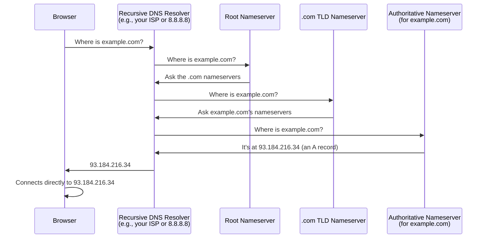
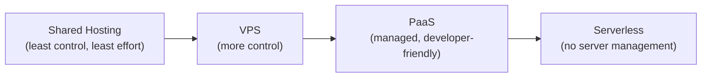
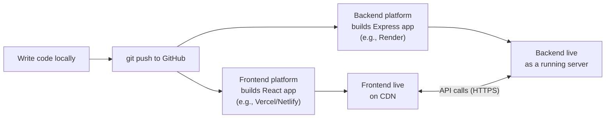
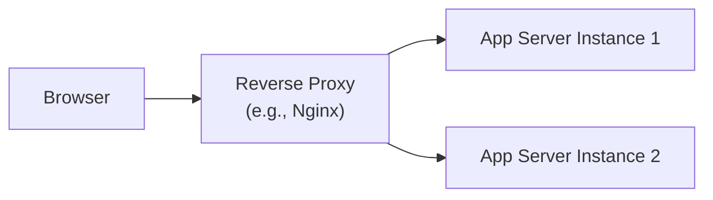

# Lecture 32: Domain, DNS and Deployment

You've built a full-stack MERN application over this semester. This final lecture covers
the last step: taking that application off your laptop and putting it on the Internet
where anyone in the world can use it. You'll learn how domain names and DNS work, what
your hosting options are, and how to actually deploy a React frontend and an Express
backend.

## In This Lecture

- Understand domain names, registrars, and the main DNS record types (A, AAAA, CNAME,
  MX, TXT)
- Understand how DNS resolution actually works, what TTL means, and how nameservers are
  configured
- Compare hosting options: shared hosting, VPS, PaaS, and serverless
- Deploy a frontend and a backend, configure environment variables and builds, and learn
  the basics of reverse proxies, SSL, and monitoring

## Domain Names and Registrars

A **domain name** is the human-readable address of a website, like `example.com`,
that stands in for a numeric **IP address** (like `93.184.216.34`) that computers
actually use to find each other on the network. Domain names exist because remembering
`example.com` is far easier for people than remembering strings of numbers.

Domain names are organized hierarchically, read right to left:

- `.com` is a **top-level domain (TLD)** — the rightmost part. Others include `.org`,
  `.net`, `.edu`, and country-specific ones like `.pk` or `.uk`.
- `example` is the **second-level domain** — the name you actually register.
- `www` (or any other prefix) is a **subdomain** — an optional label in front, used to
  organize different parts of a service (e.g., `api.example.com`, `blog.example.com`).

You cannot register a domain name directly from some central authority. Instead, you go
through a **registrar** — a company accredited to sell domain registrations, such as
Namecheap, GoDaddy, or Google Domains. Registrars handle the paperwork of reserving a
domain name for you (usually for one year at a time, renewable), but they don't host
your website's content — that's a separate job, covered later in this lecture.

!!! note "Domains and hosting are two separate purchases"
    A very common point of confusion for beginners: buying a domain name from a
    registrar does not, by itself, put a website online. You still need a **server** (or
    a hosting service) somewhere to actually store and run your application, and you
    need to tell your domain where that server is — which is exactly what DNS does.

## DNS: The Internet's Phone Book

**DNS (Domain Name System)** is the system that translates human-readable domain names
into the IP addresses computers need to actually connect to each other. It's often
described as "the Internet's phone book" — you look up a name, and it gives you a
number.

DNS information is organized into **DNS records**, stored on servers called **DNS
nameservers**, grouped into **zones** (one zone per domain, typically). Here are the
record types you'll use most often:

| Record type | Purpose | Example |
|---|---|---|
| **A** | Maps a domain/subdomain to an IPv4 address | `example.com` → `93.184.216.34` |
| **AAAA** | Maps a domain/subdomain to an IPv6 address (the newer, longer address format) | `example.com` → `2606:2800:220:1:...` |
| **CNAME** | Maps a domain/subdomain to *another domain name*, instead of directly to an IP | `www.example.com` → `example.com` |
| **MX** | Specifies which mail servers handle email for the domain, and in what priority order | `example.com` → `mail.example.com` (priority 10) |
| **TXT** | Holds arbitrary text, often used to verify domain ownership or configure email security policies (like SPF/DKIM) | `example.com` → `"v=spf1 include:_spf.google.com ~all"` |

A **CNAME** record is especially useful for the deployments you'll do in this lecture:
hosting platforms like Vercel or Netlify commonly ask you to point a subdomain (like
`www.yourapp.com`) at *their* domain via a CNAME, rather than giving you a fixed IP
address to use in an A record — because their own infrastructure's IP addresses can
change behind the scenes.

!!! tip
    You generally cannot put a CNAME record on the "bare"/"root" domain itself (e.g.
    `example.com` with no subdomain) alongside other records like MX — this is a
    historical DNS rule. Most hosting platforms provide a workaround (often called
    "ALIAS" or "ANAME" records, or platform-specific instructions) for pointing a root
    domain at them.

### How DNS Resolution Works

When you type `example.com` into your browser, a chain of lookups happens before your
computer even sends the first request to the actual website. This process is called
**DNS resolution**.



A few important pieces of vocabulary from this diagram:

- A **recursive DNS resolver** is the server that does the legwork of this whole chain
  on your behalf — often run by your Internet provider, or a public option like Google's
  `8.8.8.8` or Cloudflare's `1.1.1.1`.
- The **authoritative nameserver** for a domain is the server that holds the actual,
  official DNS records for that specific domain — this is what you configure when you
  set up your domain's DNS.
- **Nameserver configuration** happens at your registrar: you tell the registrar which
  nameservers are authoritative for your domain (often the registrar's own default
  nameservers, or a different provider's, such as Cloudflare's, if you choose to manage
  DNS there instead).

### TTL (Time to Live)

Every DNS record has a **TTL (Time to Live)** value, measured in seconds, which tells
resolvers how long they are allowed to **cache** (temporarily store and reuse) that
answer before asking again. A TTL of `3600` means "this answer is valid for one hour;
don't bother re-checking with the authoritative nameserver more often than that."

```dns
example.com.    3600    IN    A    93.184.216.34
```

TTL is a trade-off:

- A **high TTL** (e.g., 24 hours) reduces load on nameservers and speeds up repeated
  lookups, but means changes you make take longer to reach everyone, since cached
  resolvers keep serving the old answer until it expires.
- A **low TTL** (e.g., 5 minutes) means changes propagate faster, at the cost of more
  frequent lookups.

!!! tip
    If you know you're about to change a DNS record — for example, moving your site to a
    new host — lower the TTL a day or two in advance. That way, when you make the actual
    change, resolvers around the world pick up the new value quickly instead of serving
    a stale, cached answer for hours.

## Hosting Options

Once your domain points somewhere, something has to actually run your application and
answer those requests. There are several broad categories of hosting, each with a
different balance of control, effort, and cost.



- **Shared hosting** puts your website on a server alongside many other, unrelated
  websites, all sharing the same computing resources. It's cheap and simple (often just
  uploading files via FTP), but you have very little control over the server
  environment, and one site's traffic spike can, in poorly managed setups, affect
  others on the same machine. It's mostly used for simple static sites or basic PHP
  applications these days, and is a poor fit for a Node.js/Express + MongoDB app.
- **VPS (Virtual Private Server)** gives you your own isolated slice of a physical
  server, with full administrator/root access, from providers like DigitalOcean, Linode,
  or AWS EC2. You install and configure everything yourself — the operating system
  updates, Node.js, a database, a web server, security patches — which gives you
  maximum flexibility, but also maximum responsibility.
- **PaaS (Platform as a Service)** manages the server infrastructure for you. You mostly
  just provide your code (often by connecting a GitHub repository), and the platform
  handles provisioning servers, installing dependencies, and restarting your app if it
  crashes. Examples include **Render**, **Railway**, and **Heroku**. This is the
  sweet spot for most student projects and many real startups: far less setup than a
  VPS, while still running your actual backend code continuously.
- **Serverless** hosting takes managed infrastructure even further: instead of a server
  that runs continuously, your code runs only in response to individual requests/events,
  automatically scaling up and down (even down to zero when nobody's using it).
  Examples include AWS Lambda and Vercel/Netlify's serverless functions. You pay only
  for actual usage, but each function invocation is typically short-lived and stateless,
  which shapes how you can write your backend code (e.g., you generally can't keep a
  long-lived, persistent database connection open the same way you would on a VPS or
  PaaS).

| Option | Control | Setup effort | Good for |
|---|---|---|---|
| Shared hosting | Low | Very low | Simple static sites, basic PHP sites |
| VPS | Full | High | Full control, custom server setups, learning ops |
| PaaS | Medium | Low | Most student/startup full-stack apps |
| Serverless | Low (by design) | Low, but different mental model | Spiky/unpredictable traffic, event-driven code |

## Deploying Your MERN Application

With the concepts in place, here's the practical workflow for shipping a typical MERN
project: a React frontend and an Express backend, deployed separately, each to a
platform suited for it.



### Build and Environment Configuration

Before deploying, understand the difference between your **development** environment
and your **production** environment.

In development, React's dev server (`npm start` / `npm run dev`) serves your app with
helpful but heavy features like hot-reloading and unminified code, meant for a fast
feedback loop while coding — not for real users. For production, you instead create a
**build**: a command that compiles your React code into a small set of static,
optimized HTML/CSS/JS files.

```bash
# Creates an optimized, static production build in a "build" or "dist" folder
npm run build
```

Your backend also needs **environment variables** configured for production — the same
`.env`-based approach from Lecture 30, but now the real values (a production database
URL, a real JWT secret, third-party API keys) are entered into your hosting platform's
dashboard, not committed to your repository.

```bash
# .env.example — committed to the repo as documentation, not real secrets
DATABASE_URL=your-production-mongodb-uri
JWT_SECRET=your-jwt-secret
NODE_ENV=production
PORT=5000
```

### Deploying the Frontend (e.g., to Vercel or Netlify)

Platforms like **Vercel** and **Netlify** specialize in hosting frontend applications
(and serverless functions). The typical flow is:

1. Push your React project to a GitHub repository.
2. Connect that repository to Vercel/Netlify through their dashboard.
3. Configure the **build command** (usually `npm run build`) and the **output
   directory** (usually `build` for Create React App, or `dist` for Vite).
4. The platform automatically builds and deploys your app, and gives you a live URL
   (e.g., `your-app.vercel.app`) immediately.
5. Optionally, connect your own custom domain by adding the DNS records (typically a
   CNAME, as discussed earlier) that the platform tells you to add at your registrar.

From then on, every time you push new commits to your connected branch, the platform
automatically rebuilds and redeploys your site — this pattern is called **continuous
deployment**.

### Deploying the Backend (e.g., to Render)

Your Express API needs somewhere that keeps a server process running continuously (to
handle incoming requests, maintain a database connection, etc.), which is why it's
usually deployed to a PaaS like **Render** or **Railway** rather than a static-file
host like Vercel or Netlify.

1. Push your Express project to GitHub (as a separate repository, or a separate folder
   in the same repository, depending on how you organized your project).
2. Connect the repository to Render and create a new "Web Service."
3. Configure the **start command** (usually `node server.js` or `npm start`) and any
   required **environment variables** (your database URL, JWT secret, etc.) in the
   platform's dashboard.
4. Render builds and starts your server, giving you a live URL (e.g.,
   `your-api.onrender.com`) with HTTPS already configured.
5. Update your deployed frontend's configuration to point its API requests at this live
   backend URL, instead of `localhost`.

!!! warning
    Free tiers on platforms like Render often "spin down" your backend after a period of
    inactivity to save resources, and then take a noticeable few seconds to "wake up" on
    the next request. This is normal for a free/student project, but it's not what you'd
    want for a paying product with real users — that's what paid tiers (which keep your
    service running continuously) are for.

### Reverse Proxies

A **reverse proxy** is a server that sits in front of your actual application server,
receiving all incoming requests first and then forwarding them to the right place. Most
hosting platforms (and many production setups you'd configure yourself on a VPS, using
software like **Nginx**) use one, even if you never interact with it directly.



Reverse proxies commonly handle several jobs at once:

- **Terminating SSL/TLS** — the proxy manages the HTTPS certificate and encrypted
  connection with the browser, then talks to your actual application server over plain,
  unencrypted HTTP on the same private machine/network — simplifying certificate
  management to one place.
- **Load balancing** — distributing incoming requests across multiple running copies of
  your app server (as you saw in the N-tier diagram back in Lecture 2), for better
  performance and reliability.
- **Serving static files directly**, without bothering your application server with
  requests for images, CSS, or JS files.

When you deploy to a PaaS like Render, the platform runs a reverse proxy for you behind
the scenes — issuing and renewing your HTTPS certificate automatically, so you don't
have to configure TLS by hand, as noted back in Lecture 30.

### Basic Monitoring

Once your app is live, you need some way of knowing whether it's actually working —
this is called **monitoring**. At a basic level, monitoring can be as simple as:

- **Uptime monitoring** — a service (like UptimeRobot, or built into many PaaS
  dashboards) that periodically pings your app and alerts you if it stops responding.
- **Logs** — the output your server prints (`console.log`, error messages) so you can
  see what happened around the time of a problem. Most hosting platforms give you a
  dashboard to view these live logs without needing direct server access.
- **Error tracking** — tools like Sentry that automatically capture and report
  unhandled exceptions from your running application, with details like the stack trace
  and which user/request triggered it.

!!! tip
    Even for a class project, check your hosting platform's logs dashboard right after
    deploying, and again the next day. It's the fastest way to catch a crash, a missing
    environment variable, or a database connection issue that isn't obvious just from
    clicking around the live site yourself.

## Try It Yourself

1. Using a DNS lookup tool (such as running `nslookup example.com` or `dig example.com`
   in a terminal, or an online tool like `dnschecker.org`), look up the A record, MX
   records, and TXT records for a real domain of your choice. Identify the TTL value for
   at least one record.
2. Deploy the frontend and backend of a MERN project you built this semester: push the
   React app to Vercel or Netlify, and the Express API to Render or Railway. Update the
   frontend's API base URL to point at your live backend, and confirm the two can talk
   to each other over the Internet, not just on `localhost`.

## Key Takeaways

- A **domain name** is a human-readable stand-in for an IP address, purchased through a
  **registrar** — but buying a domain does not by itself host your application.
- **DNS** translates domain names to IP addresses using records like **A** (IPv4),
  **AAAA** (IPv6), **CNAME** (alias to another domain), **MX** (mail servers), and
  **TXT** (arbitrary text/verification data).
- **DNS resolution** is a chain of lookups from recursive resolver to root, to TLD, to
  authoritative nameserver; **TTL** controls how long each answer is cached along the
  way.
- Hosting ranges from **shared hosting** (cheap, low control) to **VPS** (full control,
  full responsibility) to **PaaS** (managed, developer-friendly — the best fit for most
  student MERN projects) to **serverless** (event-driven, scales to zero).
- Deploying a MERN app typically means a **build** step for the React frontend
  (deployed to something like Vercel/Netlify) and a continuously running Express server
  (deployed to something like Render), each configured with production **environment
  variables**.
- A **reverse proxy** sits in front of your app to handle SSL termination, load
  balancing, and static file serving — most PaaS platforms run one for you
  automatically, issuing HTTPS certificates without manual configuration.
- Basic **monitoring** — uptime checks, logs, and error tracking — is what tells you
  whether your live application is actually working.

## Where to Go From Here

Congratulations — you've reached the end of Web Technologies (CSC336). Over this
semester you went from the basics of how the web works all the way to building,
securing, and deploying a complete full-stack MERN application. That is a genuinely
substantial achievement, and the concepts you've learned here — client-server
architecture, REST APIs, authentication and authorization, and now security and
deployment — form the foundation of virtually all modern web development, regardless of
which specific framework you use next.

This course deliberately kept things practical and introductory. If you're curious about
what a production-grade version of everything you've built here looks like — more
advanced architecture patterns, deeper security practices (like the CSP policies and
TLS internals we only touched on), and modern frameworks like Next.js that blend
frontend and backend together — that's exactly what the **Advanced Web Technologies
(CSC337)** course covers. We hope to see you there.
